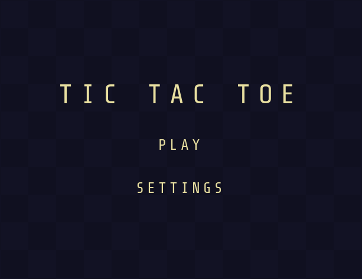

# Tic Tac Toe

A lightweight, zero-dependency Tic Tac Toe game built with vanilla JavaScript (ES Modules). Features a polished dark-grid UI, Player vs Player and Player vs AI modes, four AI difficulty levels, and keyboard-driven retry.

---

## Preview



---

## Features

- **Two game modes** — Player vs Player and Player vs AI
- **Four AI difficulties** — Random, Easy, Normal, Hard (minimax)
- **Keyboard shortcut** — press `Space` after a game ends to instantly retry
- **Animated board** — symbols pop in with a scale animation
- **Responsive** — scales down gracefully on small screens
- **No build step** — plain ES Modules, open `index.html` and play

---

## Getting Started

No installation required. Just serve the project from any static file server:

```bash
# Using the VS Code Live Server extension, or:
npx serve .

# Or with Python
python -m http.server
```

Then open `http://localhost:3000` (or whichever port) in your browser.

> **Note:** ES Modules require a server — double-clicking `index.html` will not work due to browser CORS restrictions on `file://` origins.

---

## Project Structure

```
.
├── index.html        # Entry point — mounts the app shell
├── styles.css        # All visual styles (dark grid theme, animations)
└── js/
    ├── main.js       # Bootstrap — creates state, initialises UI
    ├── state.js      # Single source of truth — initial state factory
    ├── game.js       # Core game logic — moves, win detection, AI trigger
    ├── utils.js      # Pure board utility functions
    ├── ai.js         # AI engine — four difficulty strategies
    └── ui.js         # Rendering layer — menu, settings, game screens
```

---

## Architecture Overview

The app follows a simple **unidirectional data flow**:

```
User interaction
      │
      ▼
  ui.js (event handler)
      │
      ▼
  game.js (mutates state)
      │  └── ai.js (consulted for AI moves)
      ▼
  ui.js (re-renders from state)
```

State is a plain JavaScript object created once in `main.js` and passed by reference throughout. There is no reactive framework — renders are triggered explicitly after every state mutation.

---

## Documentation

| File       | Document                                |
| ---------- | --------------------------------------- |
| `main.js`  | [Entrypoint](./documentation/main.md)   |
| `state.js` | [State](./documentation/state.md)       |
| `game.js`  | [Game Logic](./documentation/game.md)   |
| `utils.js` | [Utilities](./documentation/utils.md)   |
| `ai.js`    | [AI Engine](./documentation/ai.md)      |
| `ui.js`    | [UI & Rendering](./documentation/ui.md) |

---

## Controls

| Input | Action |
|---|---|
| Click a cell | Place your symbol |
| `Space` | Retry after game over |
| Click **Menu** | Return to main menu |

---

## AI Difficulty Reference

| Level | Strategy |
|---|---|
| **Random** | Picks any empty cell at random |
| **Easy** | Blocks the player if they are one move from winning; otherwise random |
| **Normal** | Takes a winning move if available, then blocks, then random |
| **Hard** | Perfect play via Minimax — cannot be beaten |

---

## License

MIT
